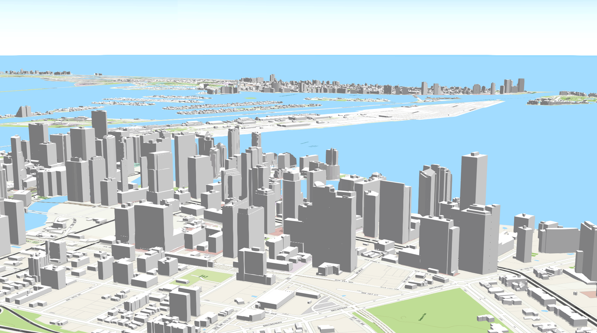

## ARC 581/681-1R Special Problems (Geospatial Visualization) - 1 credit 
## ARC 594/694-1R Geographic Information Systems in Urban Design - 3 credits
## Fall 2023  
[https://tibbben.github.io/geospatial-visualization](https://tibbben.github.io/geospatial-visualization){:alt="syllabus (this page)"} (this page)  

---

---

### Instructors:  

[//]: # (Office hours??)

Dr. Timothy Norris  
Librarian Associate Professor, Data Scientist  
University of Miami Libraries  
Institute for Data Science and Computing  
Ungar Building, 330F  
Office Hours: by appointment only (in person and virtual)  
Book appointment: [https://tibben.youcanbook.me/](https://tibben.youcanbook.me/){:target="\_blank" alt="you can book me page for Tim Norris"}  
[tnorris@miami.edu](mailto:tnorris@miami.edu)  

Christopher Mader  
Director of Software Engineering  
Institute for Data Science and Computing  
Ungar Building, 330F  
Office Hours: by appointment only (in person and virtual)  
Book appointment: [https://cmader.youcanbook.me](https://cmader.youcanbook.me){:target="\_blank" alt="you can book me page for Chris Mader"}  
[cmader@med.miami.edu](mailto:cmader@med.miami.edu)  

---

### Meetings:  

[//]: # (meeting times?? meeting place?? hybrid?? zoom links??)

August 21nd - September 22nd (581/681) / December 8th 2023 (594/694)  
Tuesdays: 2:00 pm - 4:45 pm  
Place: A49-110 (SOA Media Lab)  

[//]: # (Zoom meeting links: [https://www.courses.miami.edu/webapps/blackboard/content/launchLink](https://www.courses.miami.edu/webapps/blackboard/content/launchLink.jsp?course_id=_576809_1&content_id=_11400144_1&mode=cpview{close parenthesis}{:target="\_blank" alt="zoom links for course"})  

---

### Course Description:  

This course introduces the student to Geographic Information Systems (GIS) and how to apply GIS technologies in sustainable and resilient urban planning and architectural design contexts. Three principal activities will be emphasized: how to find, access, and use pre-existing GIS datasets; how to use industry standard tools such as ArcGIS and QGIS to perform basic analysis of geospatial data; and how to use ArcGIS and QGIS to transform and export geospatial data for use with applications such as Illustrator and AutoCAD. A series of hands on lab based exercises will build student GIS skill sets and encourage students to produce materials applicable to real-world projects for their respective research projects or design studios. The one credit option is designed to provide a basic introduction to geographic information systems, to foster spatial literacy, and to generate skills that will enable students to engage in geospatial storytelling and advanced cartographic projects. The three credit option introduces tools to enable students in more advanced geospatial data analysis and visualization with a focus on sustainable and resilient urban design and planning. 

---

### Texts and Materials: 

*Books:*  

-   Krygier, J. & Wood, D. (2016). *Making Maps: A visual Guide to Map Design for GIS (Third ed.)*. New York: The Guilford Press.  
-   Field, K. (2018). *Cartography. The Definitive Guide to Making Maps*. Redlands, ESRI Press.  

The course will use selected materials from both of the above books. The Krygier and Wood book is a great set of 'how to' materials. The Field book is a beautiful reference for all things cartography. Students are not required to purchase the two books, but acquiring your own copy is highly recommended and will make valuable additions to any personal library. Alternatively the Krygier and Wood book is available as en eBook through the library website and the instructors will provide limited access to the Field book as needed for assignments.

*Other Readings:*  

Optional reading materials will be available through online access or directly from the instructors. Please see the box folder and/or the course schedule for the links (both below).

[//]: # (How to lie with maps)

*Geospatial Data:*  

Students are required to download and transform geospatial data for projects throughout the course and for the final project. Guidance will be given on how to do this. Some good starting points include:

-   UM Libraries GIS Data Resources at [Global](https://sp.library.miami.edu/subjects/gis#tab-4), [National](https://sp.library.miami.edu/subjects/gis#tab-6), and [Florida](https://sp.library.miami.edu/subjects/gis#tab-3) based scales
-   [Redistricting Data Hub](https://redistrictingdatahub.org)
-   [WorldPop](https://www.worldpop.org)
-   [NASA's Socioeconomic Data and Applications Center (SEDAC)](https://earthdata.nasa.gov/eosdis/daacs/sedac)
-   [US Environmental Protection Agency (EPA)](https://www.epa.gov/data)
-   [EPA Smart Location Mapping](https://www.epa.gov/smartgrowth/smart-location-mapping)
-   [NOAA Sea Level Rise](https://coast.noaa.gov/slrdata)
-   [Open Street Map (OSM)](https://www.openstreetmap.org/)
-   [Open Historical Map](https://www.openhistoricalmap.org/)
-   [FEMA Flood Maps](https://www.fema.gov/flood-maps)

[//]: # (https://www.corelogic.com)
[//]: # (dataaxle)
[//]: # (https://nigeria.opendataforafrica.org/)

*Shared Box Folder*  

A shared box folder for readings and geospatial data is located at [https://miami.box.com/s/t6dpf0gnc3ubh6f6q6enf2aodmivk8zm](https://miami.box.com/s/t6dpf0gnc3ubh6f6q6enf2aodmivk8zm){:target="\_blank"}

*Presentation Schedule*  

An online xlsx file (PresentationsTopics.xlsx) for tracking the in class presentations from Field (2018) is in the shared teams folder mentioned above and can be accessed directly at: [https://miami.box.com/s/td590op4f2penu6qhdwgdntshlqzci1g](https://miami.box.com/s/td590op4f2penu6qhdwgdntshlqzci1g){:target="\_blank"}. __NOTE: ONLY OPEN WITH EXCEL ONLINE TO AVOID EDITING CONFLICTS.__

---

### Computers and Software:  

Students are required to bring a functioning computer to every class meeting (Mac, PC, or Linux).  

Throughout the course students will use several software tools that are proprietary (license provided by the University of Miami) and open-source (no license fee). With the exception of ArcGIS, any the software listed will run on any operating system (Mac, PC, or Linux). Guidance will be provided on how to choose the correct project specific software and how to install and configure a working environment on a computer.  

> Proprietary (get through UMIT)  

-   the ESRI ArcGIS suite of mapping tools:
  -   [http://www.esri.com/](http://www.esri.com/arcgis/about-arcgis){:target="\_blank"}
  -   [UMIT ArcGIS](https://www.it.miami.edu/a-z-listing/arcgis/index.html){:target="\_blank"}  
  -   Please email [software@miami.edu](mailto:software@miami.edu) with your instructor's name (Norris) and class (Arc 581/681 or ARC594/694), to gain access to ArcGIS. 

-   Mac Users: to use ESRI's ArcGIS suite on your Mac you can install bootcamp and then gain access as above (optional). As an alternative you can use Microsoft Remote Desktop and use the PCs in the SOA Media Lab (see below).
  -   Get Bootcamp from [https://support.apple.com/boot-camp](https://support.apple.com/boot-camp)
  -   Free UMIT install service at [https://studentsupport.it.miami.edu/sthd/services.html](https://studentsupport.it.miami.edu/sthd/services.html)

-   ESRI ArcGIS Online (all platforms)
  -   Get ArcGIS Online account; you should have received an invite already. If you did not receive the invite, please contact the Tim Norris [tnorris@miami.edu](mailto:tnorris@miami.edu).

-   the Adobe Creative Cloud suite of design tools
  -   [https://www.adobe.com/](https://www.adobe.com/creativecloud.html){:target="\_blank"}
  -   [UMIT Adobe Creative Cloud](https://www.it.miami.edu/a-z-listing/adobe-creative-cloud/index.html){:target="\_blank"}  

-   Citrix Workspace for Remote Labs:  
  -   Download and Install Citrix Workspace:  
      -  Windows: [https://www.citrix.com/downloads/workspace-app/windows/workspace-app-for-windows-latest.html](https://www.citrix.com/downloads/workspace-app/windows/workspace-app-for-windows-latest.html  ){:target="\_blank"}
      -  Mac: [https://www.citrix.com/downloads/workspace-app/mac/workspace-app-for-mac-latest.html](https://www.citrix.com/downloads/workspace-app/mac/workspace-app-for-mac-latest.html){:target="\_blank"}
  -   Choose a location from the bottom of [https://www.arc.miami.edu/resources/labs-and-centers/computer-lab/remote-labs/index.html](https://www.arc.miami.edu/resources/labs-and-centers/computer-lab/remote-labs/index.html) and then click on the connect button to connect to the next available computer; you will be redirected to the Citrix portal.  
  -   Use your CaneID credentials to sign in and navigate to the Desktops icon/tab located at the top. Select Architecture from the list groups and click Open to download the connection file.  Depending on your browser, a window may pop up. If not, locate the downloaded file and run it.  

-   Microsoft Remote Desktop (Only if you have access to a specific windows machine) (Mac users only, already installed on any PC):  
  -   [https://apps.apple.com/us/app/microsoft-remote-desktop-10/id1295203466?mt=12](https://apps.apple.com/us/app/microsoft-remote-desktop-10/id1295203466?mt=12){:target="\_blank" alt="microsoft remote desktop"}  

> Open-Source  

-   QGIS [https://www.qgis.org/](https://www.qgis.org/en/site/){:target="\_blank"}  
-   PostgreSQL [https://www.postgresql.org/](https://www.postgresql.org){:target="\_blank" alt="postgresql"} (optional)  

> School of Architecture Remote Labs Windows Machines (through Citrix Workspace desktop)

-   [https://www.arc.miami.edu/resources/labs-and-centers/computer-lab/remote-labs/index.html](https://www.arc.miami.edu/resources/labs-and-centers/computer-lab/remote-labs/index.html){:target="\_blank" alt="SOA Remote Labs"} (see Citrix Workspace above).

[//]: # (> Zoom (Extras for Covid19 Quarantine and Isolation)  

[//]: # (DO WE NEED THIS??)

[//]: # (-   You are expected to login to the zoom meetings scheduled for each class session whether you attend in person or through Zoom remotely. The list of Zoom meetings can be found in blackboard at the link below; you must be logged into blackboard.)

[//]: # (-   If you are under quarantine or isolation for Covid19 you will be able to access class meetings either live or as recordings through Zoom.)
[//]: # (  -   Get Zoom at: [https://www.it.miami.edu/a-z-listing/zoom/](https://www.it.miami.edu/a-z-listing/zoom/{:target="\_blank" alt="get zoom"}.)
[//]: # (  -   Class Meeting links: [https://www.courses.miami.edu/webapps/blackboard/content/launchLink](https://www.courses.miami.edu/webapps/blackboard/content/launchLink.jsp?course_id=_576809_1&content_id=_11400144_1&mode=cpview{:target="\_blank" alt="zoom links for course"})

[//]: # (-   A set of headphones with microphone to better enable class participation and to enable semi-private conversations between yourself and the instructor will be useful. These are optional, but highly recommended.)   
[//]: # (  -   USB preferable for SOA media lab machines, but micro jack will work.)  

---

### Prerequisites:   

None  

---

### Measurable Learning Outcomes:  

[//]: # (need to split this up??)

1.  Understand maps as tools for storytelling in the context of urban development and change.
2.  Able to describe geographic information systems as assemblages of data, humans, machines and code.
3.  Able to design file system structure for a GIS and geospatial data management.
4.  Know the difference between vector and raster data structures.
5.  Able to identify sources of geospatial data and to create geospatial data.
6.  Understand basic principals of map projections and coordinate reference systems.
7.  Able to perform basic overlay analysis using GIS.
8.  Able to describe classification in terms of geospatial data and cartography.
9.  Understand the basics of digital color theory for printers (subtractive - cmyk) and screens (additive - rgb).
10.  Able to perform spatial or categorical joins between two geospatial data sets/layers.
11.  Able to perform site suitability analysis with raster math.
12.  Understand map symbolization and map symbol abstraction for geospatial data.
13.  Know cartographic standards for the use of fonts in labeling geographic features on a map.
14.  Able to create print layouts both in GIS software and in graphic design software.
14.  Understand how cartographic elements come together in a map to tell stories.
15.  Place maps in context of research endeavors focused on urban sustainability and resilience.
16.  Understand maps as political tools.

---

### Practical Course Output/Activities

[//]: # (need to update??)

1.  Identify, download, install and configure appropriate software tools to construct a Geographic Information System (GIS)  
2.  Find, download, transform and organize geospatial data for use in the GIS  
3.  Construct a GIS using a combination of the above software and data  
4.  Export intermediate cartographic products from the GIS and import said products into design applications  
5.  Prepare output ready cartographic products in design applications  
6.  Design GIS-based analytic approaches for research problems in urban sustainability and resilience

---

### Methods of Instruction:  

Lecture-discussion, demonstration, and practical out-of-class and in-class assignments. Students are expected to participate in the lectures, discussions, and in-class projects. We expect that students have little or no prior GIS, cartography, graphic design, or CAD experience/training.

---

### Evaluation of Student Performance (581/681 1 credit option): 

Students will be assigned a letter grade (A-F) based on the following:

| Evaluated work | percentage / points |  
|:--- |:--- |  
| Assignments | 30% / 30 pts |  
| Class Participation | 30% / 30 pts |  
| Class Project (Initial Sketch) | 40% / 40 pts |  
| Total | 100% / 100 pts |  

### Evaluation of Student Performance (594/694 3 credit option): 

Students will be assigned a letter grade (A-F) based on the following:

| Evaluated work | percentage / points |  
|:--- |:--- |  
| Assignments | 25% / 25 pts |  
| Class Participation | 15% / 15 pts |  
| Class Project (Initial Sketch) | 10% / 10 pts |  
| Midterm Exam | 25% / 25 pts |
| Class Project (Review Presentation) | 15% / 15 pts |  
| Class Project (Final Presentation) | 10% / 10 pts |  
| Total | 100% / 100 pts |  

### Assignments:  

With the exception of the first meeting, there will be assignments for each meeting throughout the entire course. These assignments will include reading with short written summaries, practical computer work, preparation for in class presentations, and cartography/GIS assignments. All assignments made will be due in the following class meeting as per the weekly schedule.  

While the class schedule in this syllabus (below) contains guidelines for the assignments, final expectations for the individual assignments will be set during class. The instructors reserve the right to make reasonable changes to the assignments in the course schedule below.

---

### Midterm Examination:  

There will be a written midterm exam given during the week of October 9th. The exam will consist of multiple choice and short answer questions based on lecture slides and required readings.

---

### Class Participation:  

Engagement in class activities through speaking, assigned in-class presentations, and participating in thoughtful, engaged and positive criticism of instructor and student work is very important and will be evaluated for each class meeting.  

[//]: # (As a part of class participation in the Zoom meetings you may be asked to share your screen; you are expected to be prepared to share your screen at a moments notice.)

---

### Class Project:  

As a class project, each student will create at least one map layout and present it through a medium of their choice (print, projected, online, or another). All projects must be discussed and approved with one of the instructors prior to presentation. There will be three stages of presentation for this project, an initial sketch due in the fifth week, then a review presentation given during the last two of the course, and a polished presentation given during the final exam period. All students enrolled in the full three credit course must choose a class project that is within the context of urban sustainability and/or resilience. NOTE: screenshots of maps and/or map images from other publications are not acceptable in any stage of these presentations; the maps presented must be your own work and must be exported from the GIS software of choice for use in the presentations.

[//]: # (upload project folder to box)

> __Initial Sketch__ (due in week 5):

The map must have at least two layers of data displayed in a simple overlay analysis (the two layers are not background or base map layers) and there must be an aggregated data set either displayed as geographic information on the map image itself or as a summary table included in the map layout. The map layout must tell a story: this means the layout may use elements such as a title, legend, labels, geographic features, scale, descriptive text, context, locator map, insets, credits, and sources with integrity in a harmonious and holistic presentation to make a spatial argument or to present a spatial vision of past, present or future. The initial sketch of the class project will be due in the week five meeting with a brief presentation (no longer than five minutes)for a critical review by fellow students and instructors. All students enrolled in the full three credit course must also propose an urban sustainability/resilience research question that the project will seek to answer.

> __Review Presentation__ (due in weeks 14 and 15):

[//]: # (needs reconsideration for full semester course, could be in pairs? How many students should we expect?)

The map(s) for the final class project must meet all the same requirements as the initial sketch. Additionally, more than one map may be presented, at least five data layers must be put into a conversation for the story to be told, and the map(s) should be an integral part of a GIS-based analysis that seeks to answer the proposed urban sustainability and/or resilience research question. All final projects must be discussed and approved by one of the instructors. Additionally the map must be put into context with a 400-500 word written statement that accompanies the map(s). The written statement can form part of the map layout or can be a separate document. The statement will augment the story that the map (or maps) tell and will have a bibliography that lists references and all data sources used for the project (bibliography and sources not included in word count). The statement can be thought of as a five paragraph essay that touches on: 1) an introduction to the research question, 2) a discussion of data sources, 3) a summary of methods used for data transformations 4) a narrative of the story or findings, and 5) an assessment of strengths and weaknesses in the story/findings. Each final project will be presented for review in the final two course meetings; students will be prepared to give a 10-15 minute presentation about their work followed by a critique from fellow students and instructors. The presentation must include:

[//]: # (do we still want to critique SOA style??)

-   An outline of the story that the map(s) tell
-   A discussion of data sources
-   A discussion of data transformation
-   A discussion of software applications used
-   A discussion of design choices for the map(s)
-   A discussion of the findings to the proposed urban sustainability/resilience research question  
-   A self-critique of the cartographic processes with attention give to strengths and weaknesses  

[//]: # (focus more on answer or on story >> is the course to prepare students for the political realities of sustainability/resilience or simply be a researcher in this field?)

[//]: # (two sets of criteria, one for architects and one for urban design/geography)

> __Final Presentation__ (due during final exam - December 8th at 5:00 pm):  

Students will have 10 minutes (strict: 5 minutes for presentation, 5 minutes for q/a) to give a formal presentation of their class project. This is to be considered as a business presentation to clients. 

---
